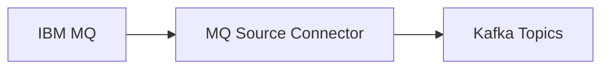
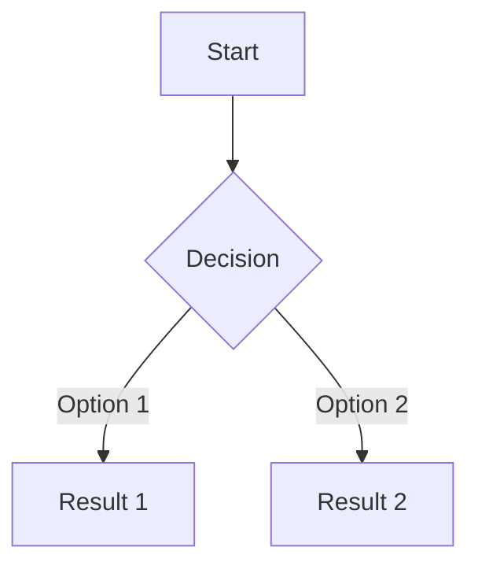
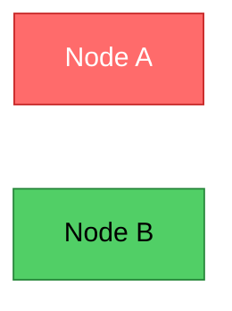
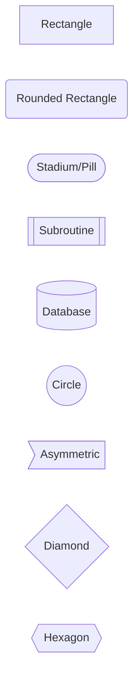
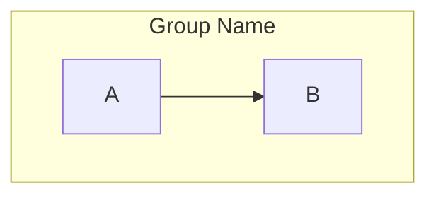
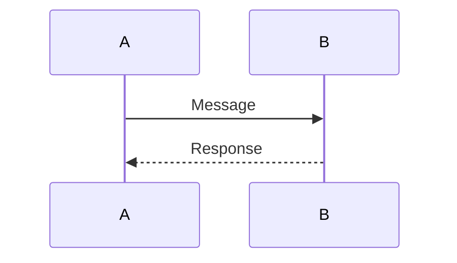

# Architecture Diagrams

This directory contains Mermaid diagrams that visualize the IBM MQ Gateway pattern with SMT-based routing architecture.

## Available Diagrams

| Diagram | Purpose | Best For |
|---------|---------|----------|
| **architecture.mmd** | Complete end-to-end architecture | Technical deep dives, documentation |
| **simplified-architecture.mmd** | High-level overview | Executive presentations, quick explanations |
| **message-flow-sequence.mmd** | Step-by-step message flow | Understanding the process, training |
| **smt-routing-logic.mmd** | SMT routing decision tree | Debugging, configuration planning |

## Viewing Diagrams

### Option 1: GitHub (Automatic)

All `.mmd` files render automatically on GitHub when viewing the repository. Just click on any `.mmd` file!

### Option 2: Mermaid Live Editor (Online)

1. Go to [Mermaid Live Editor](https://mermaid.live/)
2. Copy the contents of any `.mmd` file
3. Paste into the editor
4. View the rendered diagram
5. Export as PNG, SVG, or PDF

### Option 3: VS Code Extension

1. Install the "Markdown Preview Mermaid Support" extension
2. Open any `.mmd` file
3. Right-click → "Open Preview"

**Recommended Extensions:**
- [Markdown Preview Mermaid Support](https://marketplace.visualstudio.com/items?itemName=bierner.markdown-mermaid)
- [Mermaid Markdown Syntax Highlighting](https://marketplace.visualstudio.com/items?itemName=bpruitt-goddard.mermaid-markdown-syntax-highlighting)

### Option 4: Mermaid CLI (Export to Images)

Install Mermaid CLI:
```bash
npm install -g @mermaid-js/mermaid-cli
```

Export diagrams:
```bash
# Export to PNG
mmdc -i architecture.mmd -o architecture.png

# Export to SVG (vector, scalable)
mmdc -i architecture.mmd -o architecture.svg

# Export to PDF
mmdc -i architecture.mmd -o architecture.pdf

# Export all diagrams
mmdc -i architecture.mmd -o exports/architecture.png
mmdc -i simplified-architecture.mmd -o exports/simplified.png
mmdc -i message-flow-sequence.mmd -o exports/sequence.png
mmdc -i smt-routing-logic.mmd -o exports/routing.png
```

### Option 5: Embed in Markdown

In any Markdown file:

````markdown

````

This works in:
- GitHub README files
- GitLab
- Confluence (with plugins)
- Notion
- Many static site generators

## Diagram Details

### 1. architecture.mmd - Complete Architecture

**Shows:**
- Core banking applications publishing to MQ queues
- Gateway Queue aggregation pattern
- IBM MQ Source Connector
- SMT transformation chain
- Kafka topics (4 message types)
- Dead letter queues
- Downstream consumers

**Use for:**
- Technical documentation
- Architecture reviews
- Detailed explanations

**Color Coding:**
- 🔵 Blue: IBM MQ components
- 🟣 Purple: Connector
- 🔴 Red: SMT transformations
- 🟢 Green: Kafka topics
- 🟠 Orange: DLQ topics
- 🔵 Light Blue: Consumers

### 2. simplified-architecture.mmd - High-Level Overview

**Shows:**
- Three main components: Source (MQ), Integration (Connector), Target (Kafka)
- Single flow with routing logic

**Use for:**
- Executive presentations
- Quick overviews
- Sales/marketing materials
- Blog posts

### 3. message-flow-sequence.mmd - Message Flow Sequence

**Shows:**
- Step-by-step message journey (numbered steps)
- Interactions between components
- Timing and sequence of operations

**Use for:**
- Training materials
- Debugging message flow issues
- Understanding the process
- Developer onboarding

**Key Steps:**
1. Banking app creates message with MQ properties
2. Connector polls MQ Gateway Queue
3. Properties converted to Kafka headers
4. SMT chain processes message
5. Message routed to appropriate topic
6. Consumer processes message

### 4. smt-routing-logic.mmd - SMT Routing Decision Tree

**Shows:**
- Decision logic for message routing
- What happens when headers are missing
- Error handling paths
- Topic determination flow

**Use for:**
- Troubleshooting routing issues
- Planning routing strategies
- Understanding edge cases
- Configuration validation

**Decision Points:**
- Does messageType header exist?
- What is the header value?
- Where does the message go?
- What if there's an error?

## Customizing Diagrams

### Modify Existing Diagrams

1. Open any `.mmd` file in a text editor
2. Edit the Mermaid syntax
3. View changes in [Mermaid Live](https://mermaid.live/)
4. Save when satisfied

### Add Your Own Diagrams

Create a new `.mmd` file with Mermaid syntax:



### Styling

Mermaid supports custom styles:



## Exporting for Presentations

### For PowerPoint/Keynote

1. Export diagram to SVG:
   ```bash
   mmdc -i architecture.mmd -o architecture.svg
   ```
2. Import SVG into presentation software
3. SVG is scalable, so it looks crisp at any size

### For Google Slides

1. Export to PNG with high DPI:
   ```bash
   mmdc -i architecture.mmd -o architecture.png -w 2400 -H 1600
   ```
2. Upload to Google Slides
3. Resize as needed

### For Documentation (Confluence, Notion)

1. Export to PNG:
   ```bash
   mmdc -i architecture.mmd -o architecture.png
   ```
2. Upload image to documentation platform
3. Alternatively, use Mermaid plugins if available

### For Web/Blog Posts

1. Embed Mermaid code directly in Markdown (if supported)
2. Or export to SVG and host as static image
3. Link to interactive version on Mermaid Live

## Mermaid Syntax Quick Reference

### Flowchart Shapes



### Arrow Types

```mermaid
flowchart LR
    A --> B   %% Solid arrow
    C -.-> D  %% Dotted arrow
    E ==> F   %% Thick arrow
    G --- H   %% Line only
```

### Subgraphs



### Sequence Diagrams



## Resources

- [Mermaid Documentation](https://mermaid.js.org/)
- [Mermaid Live Editor](https://mermaid.live/)
- [Mermaid Cheat Sheet](https://jojozhuang.github.io/tutorial/mermaid-cheat-sheet/)
- [Flowchart Syntax](https://mermaid.js.org/syntax/flowchart.html)
- [Sequence Diagram Syntax](https://mermaid.js.org/syntax/sequenceDiagram.html)

## Contributing

To add or improve diagrams:

1. Edit `.mmd` files
2. Test rendering in Mermaid Live Editor
3. Ensure diagrams are clear and accurate
4. Update this README with any new diagrams
5. Export PNG/SVG versions if needed for docs

## License

These diagrams are part of the MQ Gateway Banking Demo and follow the same license as the repository.
